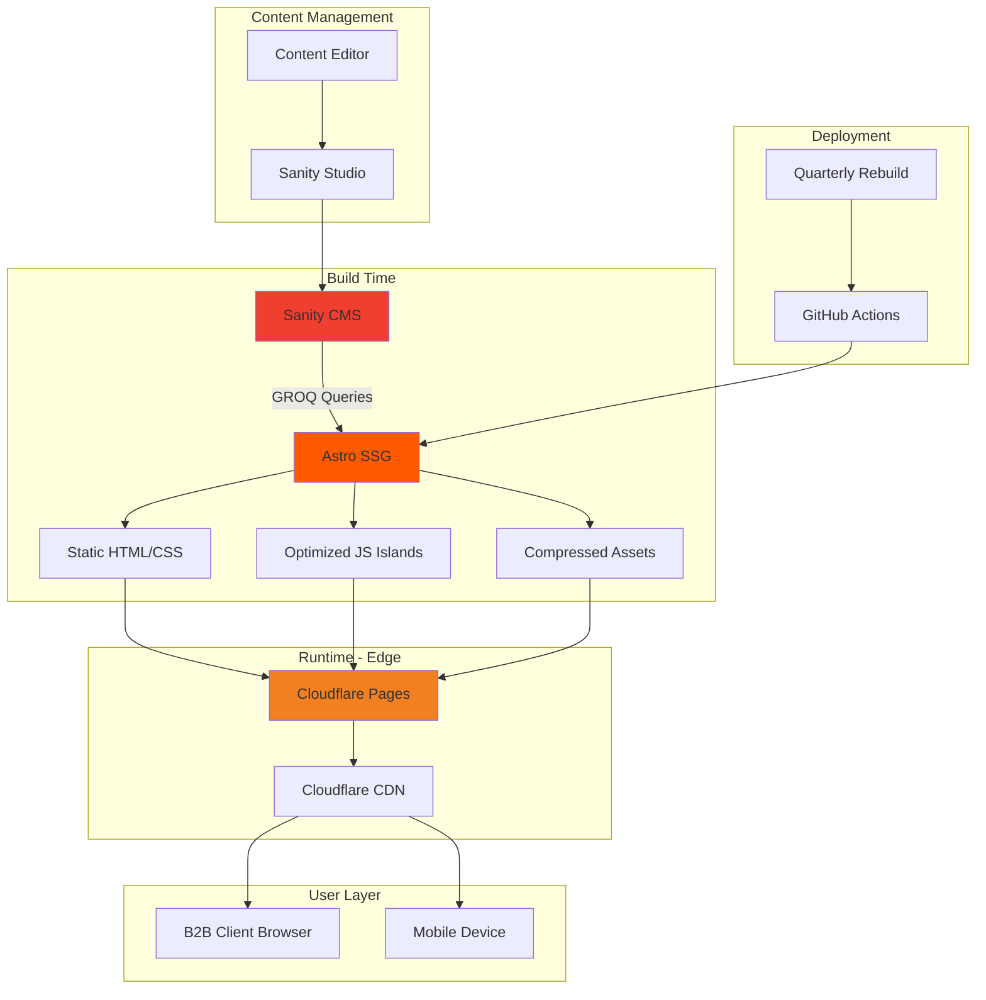

# TWG Landing Page Fullstack Architecture Document

## 1. Introduction

### 1.1 Overview

This document outlines the complete fullstack architecture for **TWG Landing Page**, including frontend implementation, content management, and deployment infrastructure. It serves as the single source of truth for development, ensuring consistency across the entire technology stack.

This is a greenfield project focused on creating an elegant, nature-inspired web presence for a woodworking and furniture manufacturer. The architecture emphasizes visual storytelling through performant glassmorphism effects and smooth interactions, while maintaining simplicity through static site generation.

### 1.2 Project Context

- **Timeline:** 2 weeks (80 man-hours per team member)
- **Team:** 5-6 developers, 3 QA testers, 1 PM, 1-2 UI/UX designers
- **Content Update Frequency:** Quarterly or annual (static content)
- **Target Audience:** B2B clients seeking woodworking partnerships
- **Deployment Strategy:** Daily preview deployments, production deployments as needed

### 1.3 Starter Template

**Status:** N/A - Greenfield Project

**Approach:** Starting with minimal Astro template, adding only necessary dependencies. This provides:
- Zero JavaScript overhead by default
- Full control over glassmorphism implementations
- Easy Sanity integration via build-time queries
- Optimal bundle size from the start

### 1.4 Change Log

| Date | Version | Description | Author |
|------|---------|-------------|--------|
| 2025-11-07 | 2.0 | Revised for Astro framework | Winston (Architect) |
| 2025-11-07 | 1.0 | Initial architecture with Next.js | Winston (Architect) |

---

## 2. High Level Architecture

### 2.1 Technical Summary

TWG Landing Page employs a **static-first architecture** with Astro as the foundation, generating pure HTML/CSS at build time with selective React islands for interactivity. Content is managed through Sanity CMS with quarterly build deployments when content updates occur.

The frontend leverages Astro's zero-JavaScript-by-default philosophy, shipping interactive components only where necessary (mobile navigation, product gallery interactions). Glassmorphism effects are achieved through pure CSS with GPU acceleration, ensuring smooth 60fps performance without JavaScript overhead.

Deployment utilizes **Cloudflare Pages** for edge delivery with automatic CDN optimization, achieving sub-second page loads globally. Video content is heavily optimized using modern codecs (WebM/MP4) with responsive loading strategies.

This architecture achieves the PRD goals of "peace and harmony" through native CSS transitions, View Transitions API (with graceful fallbacks), and continuous video loops that require no JavaScript. The system is optimized for B2B lead generation with perfect SEO scores and minimal Time to Interactive.

### 2.2 Platform and Infrastructure Choice

**Selected Platform:** Cloudflare Pages + Sanity CMS

**Key Services:**
- **Cloudflare Pages** - Static site hosting with edge delivery
- **Cloudflare CDN** - Global content distribution (automatic)
- **Cloudflare Analytics** - Privacy-focused analytics
- **Sanity CMS** - Headless content management
- **Sanity Studio** - Content editing interface
- **GitHub Actions** - CI/CD pipeline

**Deployment Host and Regions:** Global edge network (275+ cities), build artifacts stored in US-West

### 2.3 Repository Structure

**Structure:** Simple monorepo with Astro
**Package Organization:** Minimal separation - Astro app + Sanity studio

```
twg-landing/
├── src/                    # Astro source
│   ├── components/         # Astro & React components
│   ├── layouts/           # Page layouts
│   ├── pages/             # Route pages
│   └── lib/               # Utilities & Sanity client
├── sanity/                # Sanity studio
│   ├── schemas/           # Content schemas
│   └── studio/            # Studio configuration
└── public/                # Static assets
    └── videos/            # Optimized video files
```

### 2.4 High Level Architecture Diagram



### 2.5 Architectural Patterns

- **Static Site Generation (SSG):** Pre-rendered HTML at build time - _Rationale:_ Perfect for quarterly content updates, eliminates server runtime, optimal performance
- **Island Architecture:** Interactive React components in a sea of static HTML - _Rationale:_ Ships JavaScript only where needed, maintaining interactivity without bloat
- **Zero JavaScript by Default:** HTML/CSS-first approach - _Rationale:_ Instant page loads, perfect SEO, reduced complexity
- **Component-Based Architecture:** Reusable Astro components - _Rationale:_ Maintainable, consistent design system, type-safe props
- **Progressive Enhancement:** Core functionality without JavaScript - _Rationale:_ Accessibility, SEO, graceful degradation
- **Build-Time Data Fetching:** All content fetched during build - _Rationale:_ No runtime API calls, faster page loads, reduced complexity
- **Edge-First Delivery:** Static files served from nearest CDN - _Rationale:_ Global performance, automatic scaling, cost-effective

### 2.6 Browser Support Matrix

| Browser | Version | Support Level | Notes |
|---------|---------|---------------|-------|
| Chrome | Latest 2 | ✅ Full | View Transitions API native |
| Edge | Latest 2 | ✅ Full | View Transitions API native |
| Safari | Latest 2 | ✅ Full | CSS transitions fallback |
| Firefox | Latest 2 | ✅ Full | CSS transitions fallback |
| Safari iOS | 15+ | ✅ Full | Static image for hero |
| Chrome Android | Latest | ✅ Full | Reduced video quality |

### 2.7 Development & Deployment Strategy

**Branch Strategy:**
```
main          → Production (twg-landing.com)
development   → Preview (preview.twg-landing.pages.dev)
feature/*     → Feature branches
```

**CI/CD Pipeline:**
```yaml
# .github/workflows/deploy.yml
on:
  push:
    branches: [main, development]

jobs:
  build-and-deploy:
    steps:
      - Build Astro site
      - Run tests (Playwright)
      - Deploy to Cloudflare Pages
```

**Content Update Workflow:**
1. Content team updates in Sanity Studio
2. Quarterly: Trigger rebuild via GitHub Actions
3. Automatic deployment to production
4. Old content cached at edge until new build propagates

---

## 3. Tech Stack

### 3.1 Technology Stack Table

| Category | Technology | Version | Purpose | Rationale |
|----------|-----------|---------|---------|-----------|
| **Framework** | Astro | 4.0+ | Static site generator | Zero JS by default, perfect for static content |
| **Language** | TypeScript | 5.3+ | Type-safe development | Prevents errors, better IDE support |
| **View Components** | Astro Components | Native | Static templates | No runtime overhead, HTML-first |
| **Interactive UI** | React | 18.3+ | Islands only | Only for interactive components |
| **Styling** | Tailwind CSS | 3.4+ | Utility-first CSS | Rapid development, consistent design |
| **CSS Architecture** | CSS Modules | Native | Scoped styles | Complex glassmorphism effects |
| **View Transitions** | Native API | Browser | Page transitions | Smooth navigation (Chrome/Edge) |
| **Animation Fallback** | CSS Transitions | Native | Safari/Firefox | Pure CSS animations |
| **Build Tool** | Vite | 5.0+ | Bundling | Built into Astro, fast builds |
| **Content Management** | Sanity CMS | 3.37+ | Headless CMS | Structured content, existing workspace |
| **Image Optimization** | Astro Image | Built-in | Automatic optimization | WebP/AVIF, responsive images |
| **Video Processing** | FFmpeg | Latest | Pre-processing | Compress videos for web |
| **Font Loading** | Astro Font | Built-in | Web fonts | Zero layout shift |
| **SEO** | Astro SEO | Built-in | Meta tags | Type-safe, automatic sitemap |
| **Analytics** | Cloudflare Analytics | N/A | Privacy-focused | No cookies, GDPR compliant |
| **Error Tracking** | Sentry | Latest | Production monitoring | Minimal runtime impact |
| **Testing - Unit** | Vitest | 1.4+ | Component tests | Fast, ESM native |
| **Testing - E2E** | Playwright | 1.42+ | Browser testing | Cross-browser support |
| **Linting** | ESLint | 8.57+ | Code quality | Astro plugin included |
| **Formatting** | Prettier | 3.2+ | Code formatting | Consistent style |
| **Package Manager** | pnpm | 8.15+ | Dependencies | Fast, efficient |
| **Version Control** | Git + GitHub | N/A | Source control | CI/CD integration |
| **CI/CD** | GitHub Actions | N/A | Automation | Free, integrated |
| **Hosting** | Cloudflare Pages | N/A | Static hosting | Edge delivery |
| **CDN** | Cloudflare CDN | N/A | Asset delivery | Global, automatic |
| **Validation** | Zod | 3.22+ | Type validation | Content validation |

---

## 4. Data Models

### 4.1 Content Architecture

Since content updates are quarterly, all data is fetched at build time and embedded into the static HTML. The following models define the content structure in Sanity.

#### Site Settings
```typescript
interface SiteSettings {
  siteName: string;
  catchphrase: string;
  logo: SanityImage;
  navigationItems: NavigationItem[];
  contactEmail: string;
  socialLinks?: SocialLink[];
  seo: SEOMetadata;
}
```

#### Page Model
```typescript
interface Page {
  _id: string;
  _type: 'page';
  title: string;
  slug: { current: string };
  heroSection: HeroSection;
  contentBlocks: ContentBlock[];
  seo: SEOMetadata;
}

interface HeroSection {
  heading: string;
  subheading?: string;
  backgroundMedia: {
    type: 'video' | 'image';
    video?: { url: string; poster: string };
    image?: SanityImage;
  };
}
```

#### Product Category
```typescript
interface ProductCategory {
  _id: string;
  name: string;
  slug: { current: string };
  description: string;
  featuredImage: SanityImage;
  specifications: Specification[];
  gallery: SanityImage[];
  ctaText: string;
  order: number;
}
```

---

## 5. Component Architecture

### 5.1 Astro Components (Zero JavaScript)

#### Glass Card Component
```astro
---
// GlassCard.astro
export interface Props {
  blur?: number;
  opacity?: number;
  class?: string;
}

const { blur = 10, opacity = 0.1, class: className = '' } = Astro.props;
---

<div class={`glass-card ${className}`} data-blur={blur} data-opacity={opacity}>
  <slot />
</div>

<style define:vars={{ blur, opacity }}>
  .glass-card {
    backdrop-filter: blur(calc(var(--blur) * 1px));
    background: rgba(255, 255, 255, var(--opacity));
    border-radius: 12px;
    border: 1px solid rgba(255, 255, 255, 0.2);
  }

  @supports not (backdrop-filter: blur(1px)) {
    .glass-card {
      background: rgba(255, 255, 255, 0.9);
    }
  }
</style>
```

#### Hero Video Component
```astro
---
// HeroVideo.astro
export interface Props {
  webm: string;
  mp4: string;
  poster: string;
  heading: string;
  subheading?: string;
}

const { webm, mp4, poster, heading, subheading } = Astro.props;
---

<section class="hero">
  <video
    autoplay
    loop
    muted
    playsinline
    poster={poster}
    class="hero-video"
  >
    <source src={webm} type="video/webm" />
    <source src={mp4} type="video/mp4" />
  </video>

  <div class="hero-content">
    <h1 class="hero-heading">{heading}</h1>
    {subheading && <p class="hero-subheading">{subheading}</p>}
  </div>
</section>

<style>
  .hero {
    position: relative;
    height: 100vh;
    overflow: hidden;
  }

  .hero-video {
    position: absolute;
    top: 50%;
    left: 50%;
    min-width: 100%;
    min-height: 100%;
    transform: translate(-50%, -50%);
    object-fit: cover;
  }

  .hero-content {
    position: relative;
    z-index: 1;
    display: flex;
    flex-direction: column;
    justify-content: center;
    align-items: center;
    height: 100%;
    text-align: center;
    color: white;
  }

  @media (max-width: 768px) {
    .hero-video {
      display: none;
    }

    .hero {
      background-image: var(--poster-image);
      background-size: cover;
      background-position: center;
    }
  }
</style>
```

### 5.2 React Islands (Interactive Only)

#### Mobile Navigation Island
```tsx
// MobileNav.tsx - Only component that ships JS for navigation
import { useState } from 'react';

interface Props {
  items: Array<{ label: string; href: string }>;
}

export default function MobileNav({ items }: Props) {
  const [isOpen, setIsOpen] = useState(false);

  return (
    <nav className="mobile-nav">
      <button
        onClick={() => setIsOpen(!isOpen)}
        className="menu-toggle"
        aria-label="Toggle menu"
      >
        <span className="hamburger" />
      </button>

      {isOpen && (
        <div className="menu-overlay">
          {items.map(item => (
            <a key={item.href} href={item.href}>
              {item.label}
            </a>
          ))}
        </div>
      )}
    </nav>
  );
}
```

Usage in Astro:
```astro
---
import MobileNav from '@/components/MobileNav';
const navItems = await getNavigation();
---

<!-- Only loads JS on mobile devices -->
<MobileNav client:media="(max-width: 768px)" items={navItems} />
```

### 5.3 Build-Time Data Fetching

```typescript
// lib/sanity.ts
import { createClient } from '@sanity/client';

const client = createClient({
  projectId: import.meta.env.SANITY_PROJECT_ID,
  dataset: 'production',
  apiVersion: '2024-01-01',
  useCdn: false, // We're fetching at build time
});

export async function getSiteSettings() {
  return client.fetch(`
    *[_type == "siteSettings"][0]{
      siteName,
      catchphrase,
      logo,
      navigationItems[] | order(order asc),
      contactEmail,
      socialLinks
    }
  `);
}

export async function getPageBySlug(slug: string) {
  return client.fetch(
    `*[_type == "page" && slug.current == $slug][0]`,
    { slug }
  );
}

export async function getAllProducts() {
  return client.fetch(`
    *[_type == "productCategory"] | order(order asc)
  `);
}
```

---

## 6. Performance Strategy

### 6.1 Core Web Vitals Targets

| Metric | Target | Strategy |
|--------|--------|----------|
| **LCP** | <1.5s | Optimized hero video, edge CDN |
| **FID** | <50ms | Minimal JavaScript |
| **CLS** | <0.05 | Font preloading, aspect ratios |
| **FCP** | <1s | Critical CSS inline |

### 6.2 Optimization Techniques

**Video Optimization:**
```bash
# FFmpeg compression for hero video
ffmpeg -i input.mp4 \
  -c:v libvpx-vp9 -b:v 600k \
  -vf scale=1920:1080 \
  -an output.webm

ffmpeg -i input.mp4 \
  -c:v libx264 -b:v 600k \
  -vf scale=1920:1080 \
  -preset slow -crf 28 \
  -an output.mp4
```

**Critical CSS:**
```astro
---
// Layout.astro
---
<style is:inline>
  /* Critical above-fold styles */
  .hero { ... }
  .glass-effect { ... }
</style>
```

### 6.3 Bundle Size Budget

| Resource | Budget | Actual |
|----------|--------|--------|
| HTML | <15KB | ~10KB |
| CSS | <20KB | ~15KB |
| JavaScript | <10KB | ~5KB (React island) |
| Hero Video | <2.5MB | ~2MB |
| Total First Load | <50KB | ~30KB (excluding video) |

---

## 7. Deployment Architecture

### 7.1 Build Pipeline

```yaml
# .github/workflows/deploy.yml
name: Deploy to Cloudflare Pages

on:
  push:
    branches: [main, development]
  workflow_dispatch: # Manual trigger for quarterly updates

jobs:
  deploy:
    runs-on: ubuntu-latest
    steps:
      - uses: actions/checkout@v3

      - uses: pnpm/action-setup@v2
        with:
          version: 8

      - name: Install dependencies
        run: pnpm install

      - name: Build Astro site
        run: pnpm build
        env:
          SANITY_PROJECT_ID: ${{ secrets.SANITY_PROJECT_ID }}

      - name: Run E2E tests
        run: pnpm test:e2e

      - name: Deploy to Cloudflare Pages
        uses: cloudflare/pages-action@v1
        with:
          apiToken: ${{ secrets.CLOUDFLARE_API_TOKEN }}
          accountId: ${{ secrets.CLOUDFLARE_ACCOUNT_ID }}
          projectName: twg-landing
          directory: dist
          gitHubToken: ${{ secrets.GITHUB_TOKEN }}
```

### 7.2 Environments

| Environment | URL | Purpose | Deploy Trigger |
|-------------|-----|---------|----------------|
| Production | twg-landing.com | Live site | Push to main |
| Preview | preview.twg-landing.pages.dev | Testing | Push to development |
| PR Preview | pr-*.twg-landing.pages.dev | Review | Pull requests |

---

## 8. Content Validation

### 8.1 Sanity Schema Validation

```javascript
// sanity/schemas/validation.js
export const imageValidation = Rule => Rule
  .required()
  .custom((image) => {
    if (!image?.asset) return 'Image is required';

    // Max 5MB
    if (image.asset.size > 5000000) {
      return 'Image must be under 5MB';
    }

    // Require alt text
    if (!image.alt) {
      return 'Alt text is required for accessibility';
    }

    return true;
  });

export const videoValidation = Rule => Rule
  .custom((file) => {
    if (!file?.asset) return true;

    // Max 10MB for videos
    if (file.asset.size > 10000000) {
      return 'Video must be under 10MB';
    }

    return true;
  });

export const slugValidation = Rule => Rule
  .required()
  .custom((slug) => {
    if (!/^[a-z0-9-]+$/.test(slug.current)) {
      return 'Slug must be lowercase with hyphens only';
    }
    return true;
  });
```

---

## 9. Testing Strategy

### 9.1 Test Coverage

| Type | Tool | Coverage |
|------|------|----------|
| Unit Tests | Vitest | Component logic |
| Visual Regression | Percy | UI consistency |
| E2E Tests | Playwright | User journeys |
| Performance | Lighthouse CI | Core Web Vitals |
| Accessibility | axe-core | WCAG compliance |

### 9.2 E2E Test Example

```typescript
// tests/e2e/navigation.test.ts
import { test, expect } from '@playwright/test';

test.describe('Navigation', () => {
  test('should navigate between pages smoothly', async ({ page }) => {
    await page.goto('/');

    // Check hero video loads
    const video = page.locator('video');
    await expect(video).toBeVisible();

    // Navigate to products
    await page.click('text=Products');

    // Verify View Transition (if supported)
    if (await page.evaluate(() => 'startViewTransition' in document)) {
      // Transition should be smooth
      await expect(page).toHaveURL('/products');
    }

    // Check glassmorphism effects
    const glassCard = page.locator('.glass-card').first();
    const backdrop = await glassCard.evaluate((el) => {
      return window.getComputedStyle(el).backdropFilter;
    });
    expect(backdrop).toContain('blur');
  });
});
```

---

## 10. Monitoring & Analytics

### 10.1 Monitoring Stack

- **Performance:** Cloudflare Analytics (built-in)
- **Errors:** Sentry (client-side only, minimal)
- **Uptime:** Cloudflare health checks
- **SEO:** Google Search Console

### 10.2 Key Metrics

**Business Metrics:**
- Page views by source
- Contact form submissions
- Product category clicks
- Video engagement rate

**Technical Metrics:**
- Core Web Vitals
- Build times
- CDN cache hit rate
- Error rate

---

## 11. Project Structure

```
twg-landing/
├── .github/
│   └── workflows/
│       ├── deploy.yml
│       └── test.yml
├── src/
│   ├── components/
│   │   ├── Glass/
│   │   │   ├── GlassCard.astro
│   │   │   ├── GlassButton.astro
│   │   │   └── GlassNav.astro
│   │   ├── Islands/
│   │   │   ├── MobileNav.tsx
│   │   │   └── ProductGallery.tsx
│   │   └── Layout/
│   │       ├── BaseLayout.astro
│   │       ├── Header.astro
│   │       └── Footer.astro
│   ├── content/           # Optional: local content
│   ├── layouts/
│   │   └── Layout.astro
│   ├── lib/
│   │   ├── sanity.ts      # Sanity client & queries
│   │   └── utils.ts       # Helper functions
│   ├── pages/
│   │   ├── index.astro    # Landing page
│   │   ├── products/
│   │   │   ├── index.astro
│   │   │   └── [slug].astro
│   │   ├── manufacturing.astro
│   │   ├── sustainability.astro
│   │   └── contact.astro
│   └── styles/
│       └── global.css      # Global styles & Tailwind
├── public/
│   ├── fonts/
│   ├── images/
│   └── videos/
│       ├── hero.webm
│       └── hero.mp4
├── sanity/
│   ├── schemas/
│   │   ├── documents/
│   │   ├── objects/
│   │   └── index.ts
│   └── studio/
├── tests/
│   ├── e2e/
│   └── unit/
├── astro.config.mjs
├── tailwind.config.mjs
├── tsconfig.json
├── package.json
└── README.md
```

---

## 12. Development Workflow

### 12.1 Local Setup

```bash
# Prerequisites
node >= 18.0.0
pnpm >= 8.0.0

# Clone and install
git clone https://github.com/twg/landing.git
cd landing
pnpm install

# Environment setup
cp .env.example .env.local
# Add Sanity project ID and dataset

# Start development
pnpm dev

# Build for production
pnpm build
pnpm preview
```

### 12.2 Development Commands

```json
{
  "scripts": {
    "dev": "astro dev",
    "build": "astro build",
    "preview": "astro preview",
    "test": "vitest",
    "test:e2e": "playwright test",
    "lint": "eslint src",
    "format": "prettier --write .",
    "sanity": "cd sanity && sanity dev"
  }
}
```

---

## 13. Coding Standards

### 13.1 Critical Rules

- **Zero JavaScript by Default:** Only use client-side JS for essential interactivity
- **Component Composition:** Prefer Astro components over React unless interactivity required
- **Type Safety:** All props must be typed, no `any`
- **Performance First:** Every decision must consider Core Web Vitals impact
- **Accessibility:** All images need alt text, all interactions keyboard accessible
- **Content Validation:** All Sanity fields validated at schema level

### 13.2 File Naming

| Type | Convention | Example |
|------|------------|---------|
| Astro Components | PascalCase | `GlassCard.astro` |
| React Islands | PascalCase | `MobileNav.tsx` |
| Pages | kebab-case | `manufacturing.astro` |
| Utilities | camelCase | `fetchContent.ts` |

---

## 14. Checklist Results

_To be completed after architecture review_

- [ ] Performance budget defined
- [ ] SEO requirements met
- [ ] Accessibility standards defined
- [ ] Content validation rules implemented
- [ ] Deployment pipeline configured
- [ ] Monitoring setup completed
- [ ] Documentation complete