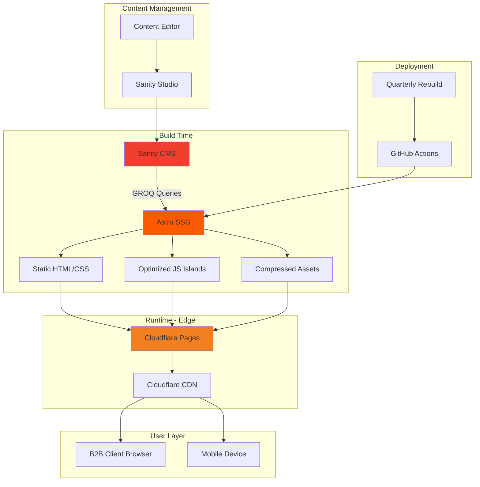

# 2. High Level Architecture

## 2.1 Technical Summary

TWG Landing Page employs a **static-first architecture** with Astro as the foundation, generating pure HTML/CSS at build time with selective React islands for interactivity. Content is managed through Sanity CMS with quarterly build deployments when content updates occur.

The frontend leverages Astro's zero-JavaScript-by-default philosophy, shipping interactive components only where necessary (mobile navigation, product gallery interactions). Glassmorphism effects are achieved through pure CSS with GPU acceleration, ensuring smooth 60fps performance without JavaScript overhead.

Deployment utilizes **Cloudflare Pages** for edge delivery with automatic CDN optimization, achieving sub-second page loads globally. Video content is heavily optimized using modern codecs (WebM/MP4) with responsive loading strategies.

This architecture achieves the PRD goals of "peace and harmony" through native CSS transitions, View Transitions API (with graceful fallbacks), and continuous video loops that require no JavaScript. The system is optimized for B2B lead generation with perfect SEO scores and minimal Time to Interactive.

## 2.2 Platform and Infrastructure Choice

**Selected Platform:** Cloudflare Pages + Sanity CMS

**Key Services:**
- **Cloudflare Pages** - Static site hosting with edge delivery
- **Cloudflare CDN** - Global content distribution (automatic)
- **Cloudflare Analytics** - Privacy-focused analytics
- **Sanity CMS** - Headless content management
- **Sanity Studio** - Content editing interface
- **GitHub Actions** - CI/CD pipeline

**Deployment Host and Regions:** Global edge network (275+ cities), build artifacts stored in US-West

## 2.3 Repository Structure

**Structure:** Simple monorepo with Astro
**Package Organization:** Minimal separation - Astro app + Sanity studio

```
twg-landing/
├── src/                    # Astro source
│   ├── components/         # Astro & React components
│   ├── layouts/           # Page layouts
│   ├── pages/             # Route pages
│   └── lib/               # Utilities & Sanity client
├── sanity/                # Sanity studio
│   ├── schemas/           # Content schemas
│   └── studio/            # Studio configuration
└── public/                # Static assets
    └── videos/            # Optimized video files
```

## 2.4 High Level Architecture Diagram



## 2.5 Architectural Patterns

- **Static Site Generation (SSG):** Pre-rendered HTML at build time - _Rationale:_ Perfect for quarterly content updates, eliminates server runtime, optimal performance
- **Island Architecture:** Interactive React components in a sea of static HTML - _Rationale:_ Ships JavaScript only where needed, maintaining interactivity without bloat
- **Zero JavaScript by Default:** HTML/CSS-first approach - _Rationale:_ Instant page loads, perfect SEO, reduced complexity
- **Component-Based Architecture:** Reusable Astro components - _Rationale:_ Maintainable, consistent design system, type-safe props
- **Progressive Enhancement:** Core functionality without JavaScript - _Rationale:_ Accessibility, SEO, graceful degradation
- **Build-Time Data Fetching:** All content fetched during build - _Rationale:_ No runtime API calls, faster page loads, reduced complexity
- **Edge-First Delivery:** Static files served from nearest CDN - _Rationale:_ Global performance, automatic scaling, cost-effective

## 2.6 Browser Support Matrix

| Browser | Version | Support Level | Notes |
|---------|---------|---------------|-------|
| Chrome | Latest 2 | ✅ Full | View Transitions API native |
| Edge | Latest 2 | ✅ Full | View Transitions API native |
| Safari | Latest 2 | ✅ Full | CSS transitions fallback |
| Firefox | Latest 2 | ✅ Full | CSS transitions fallback |
| Safari iOS | 15+ | ✅ Full | Static image for hero |
| Chrome Android | Latest | ✅ Full | Reduced video quality |

## 2.7 Development & Deployment Strategy

**Branch Strategy:**
```
main          → Production (twg-landing.com)
development   → Preview (preview.twg-landing.pages.dev)
feature/*     → Feature branches
```

**CI/CD Pipeline:**
```yaml
# .github/workflows/deploy.yml
on:
  push:
    branches: [main, development]

jobs:
  build-and-deploy:
    steps:
      - Build Astro site
      - Run tests (Playwright)
      - Deploy to Cloudflare Pages
```

**Content Update Workflow:**
1. Content team updates in Sanity Studio
2. Quarterly: Trigger rebuild via GitHub Actions
3. Automatic deployment to production
4. Old content cached at edge until new build propagates

---
